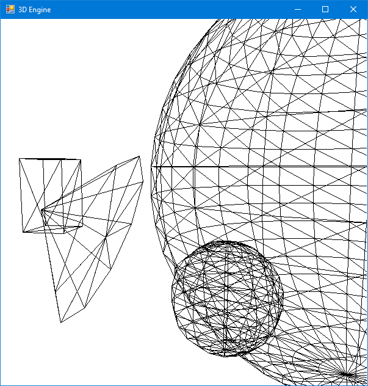
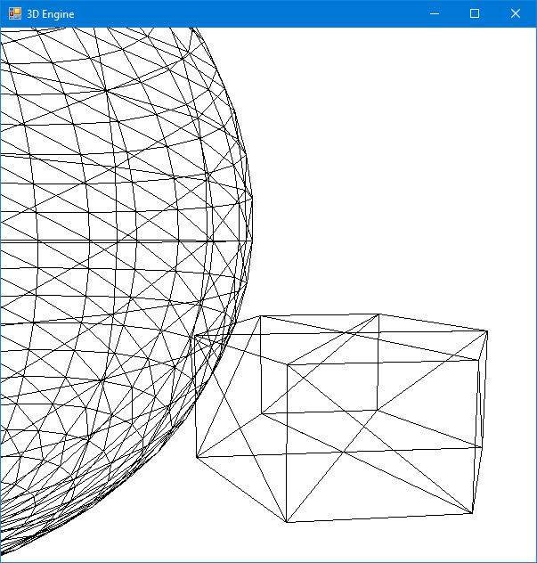

# 3D Engine

3D graphics engine for CPU created from scratch with Microsoft .NET Framework in C#.

The app displays a 3D scene that is first loaded from the XML file. The user can control and move a free camera.

## Table of Contents

* [General Info](#general-information)
* [Screenshots](#screenshots)
* [Features](#features)
* [Setup](#setup)
* [Contact](#contact)

## General Information

The application displays a 3D scene. Users can control the camera by pressing the A, W, S, D and arrow keys (responsible for moving and rotating
the camera, respectively).

First, the application loads the scene saved in the XML file. The file stores information about scene elements such as their type, size,
position, rotation and number of triangles in a single mesh. There are four types of elements that can be loaded: cuboids, spheres, cylinders
and cones. After the application reads the XML file, meshes are generated based on the data provided. After this process is completed, 
the scene is displayed and the user can move around the 3D space.

It is one of the projects which I have developed during my free time. Through this project, I was able to better understand the math behind
3D graphics, since I implemented the logic from scratch. The project also required solving some algorithmic problems, e.g. generating meshes
based on a given type and number of triangles.

## Screenshots

## Features

- Generate meshes based on the information stored in the XML file
- Display 3D scene
- Move the camera around the scene
- Display the time needed to render one frame and current fps

## Setup

To build the project firstly you need to import the project into Visual Studio.

## Contact

Created by Rafał Bogdanowicz - feel free to contact me by e-mail: <bogdaraf@gmail.com>